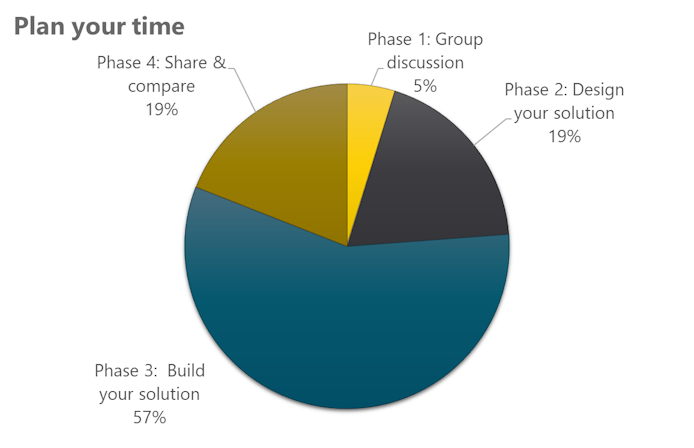

# Applied Workshop: PL-200 Power Platform Functional Consultant

## Workshop overview

In this workshop, you will create your own solution to the stated problems.

This workshop is open-ended by design. Use this time to practice what you need, and don’t be afraid to use
your trainer for help when you get stuck.

You will need to evaluate the requirements and build the solutions and automation as required. Think of
this like building a functioning proof of concept. The data model has been defined for you, but the specifics
of the apps are left to you to design. Make sure you design with users top of mind for a good experience
that meets the stated requirements.

If time allows, you will have a chance to share your solution with your peers for review and feedback.

**Note:** You are only completing one scenario. We’ve given you three to choose from. Review them and
choose the one you’d like to build.

 

---

 

## Scenarios

### Scenario 1: Northwind Traders basketball player recruiting

Northwind Traders basketball club is implementing a new system to manage their player recruitment. You
will be building the data model provided and creating any needed Power Apps and automating. The data
model will be provided for you as well as requirements for building and automating the Power Apps.

### Scenario 2: Tailwind recruiting job fair app

Tailwind is a recruiting agency. They hold job fairs and would like to create two custom applications. One
application that will allow their office staff to create recruits, contacts, and recruit interviews, and a canvas
application to be used at job fairs. Tailwind Traders converts recruits into contacts after they placed them
with an employer.

### Scenario 3: Woodgrove Youth Camp camper activity tracker

Woodgrove Youth Camp provides supervised programs in the summer for children between the ages of 8
and 12. They would like to create two applications. One application will allow their office staff to create
campers, contacts, and camper reports, and the other will be used at the camp site by the counselors.

 

---

 

## Time management

You have a day to complete all aspects of this assignment. Review all the expectations first, then begin to manage your time. Phase 1 is designed to be a small group discussion, however if you are working solo then take the time to brainstorm on your own to help you with the rest of the assignment. Most of your time should be spent in Phases 2 and 3. Your instructor will let you know when to start Phase 4, but plan for it to take about 6 0 minutes of your time.

Plan for the following:
- Phase 1: Small group discussion (15 min)
- Phase 2: Design your solution (60 min)
- Phase 3: Build your solution (180 min)
- Phase 4: Share and compare your solutions (60 min)

    

### Phase 1: Small group discussion

Discuss with your small group the idea of building the solution. Have a brainstorming session about how you might approach the requirements.

#### Discussion points

- Which scenario did you choose?
- Do you know what you need to build?
- Are there any distractors or irrelevant information offered?

### Phase 2: Design your solution

Now you should plan how you will approach the solution. Put pen to paper (or digital, or whatever works for
you) and make your to-do list.

#### Considerations

- Do you know where information should be entered for each item?
- What automation will you include?

### Phase 3: Build your solution

Time to make your solution.

#### Considerations

- Do you have the information needed to complete the required elements?
- Do you need to make assumptions to accommodate for vague requirements?
- Do you have enough time to complete all tasks?

### Phase 4: Share and compare your solution

Share your solution with your small group. Compare the experience. Can you export your solution and
import it to another environment.

#### Considerations

- How do others’ solutions compare to yours? What is similar? What is different?
- How would you improve your solution?
- What did you learn?

### Requirements

Here are the details for each of the three scenarios. Remember that you are only completing this project
today for the scenario of your choice.

 

---

 

### Scenario 1

Northwind Traders basketball club is implementing a new system to manage their player recruitment. You
will be building the data model provided and creating any needed Power Apps and automating. The data
model will be provided for you as well as requirements for building and automating the Power Apps.

#### Microsoft Dataverse requirements

- Create tables and columns for players and scouting reports.
- Create relationships for contacts, players, scouts (Users), and scouting reports.
- Create needed forms and views.
- Add new column to the contact table.

***Player table columns***

| Column | Type  | Requirement| 
| --- | --- | --- |
| First name | Single line of text | Required |
| Last name  | Single line of text | Required |
| Height     | Single line of text | Required | 
| Weight     | Single line of text | Required |
| Date of birth | Date only | Optional |
| Position | Single line of text | Optional |
| Experience | Single line of text | Optional
| Salary | Currency | Optional |
| Contract expiration date | Date only | Optional |
| Last drug test | Date only Optional |
| Drug test result | Choice: Unknown, Passed, Failed, Inconclusive. Make Unknown the default value | Optional |
| Minutes per game | Decimal | Optional |
| Points per game | Decimal | Optional |
| Filed goal percentage | Decimal | Optional |
| Free throw percentage | Decimal | Optional |
| Three-point percentage | Decimal | Optional |
| Primary scout | Lookup to the user table | Optional |
| Photo | Image file. Use this as primary image. | Optional |
| Full name | Single line of text.<bre>Calculated from first and last name. | |
| Age | Whole number. Calculated from date of birth.|

**Other requirements for the Player table:**

Player status can be Active, Recruiting, Draft Prospect, Free Agent, and Retired.

***Scouting report table columns***

| Column | Type  | Requirement |
| --- | --- | --- | 
| Name           | Single line of text | Required |
| Player         | Lookup to the player table | Required |
| Strengths      | Rich text | Required |
| Weaknesses     | Rich text | Required |
| Comments       | Rich text | Required |
| Pro comparison | Single line of text | Optional |
| Photo | Image file. Use this as primary image. | Optional |

***Contact table columns***

| Column | Type  | Requirement |
| --- | --- | --- | 
| Contact type | Choice: Publicist, Agent, Doctor, Other | Optional|

***Table relationships***

| Tables | Type | 
| --- | ---- | 
| Contact to Player      | Many-to-one |
| Player to Scout report | One-to-many |
| Player to User         | Many-to-one |

***Forms and views***

Build the appropriate forms and views for the data model you’ve built to be used in the model driven app.

- Decide what columns need to be on the forms and in what order, what columns do you need to add/remove from your views, consider what columns should be read-only, do you need to present related tables as sub-grids.
- Decide if you should edit the default forms and views, should you create new from existing forms and views, or should you create them from scratch.
- Enable column security for the **Drug test result** and **Last drug test** columns.

***Security roles***

Create a security role that will allow scouts to:
- Create, edit players and contacts.
- Edit their own scouting reports and create scouting reports.

Create a column security profile that allows scout managers to:

- Give scout managers read, update, and create permissions to the Last drug test and Drug test result columns.

#### Model-driven application requirements

Create a model-driven app that is appropriate for office staff to use to complete their needed tasks. Include
navigation, tables, forms, views, and all the necessary components.

- Users should be able to
    * Create/edit new player records.
    * Create/edit contacts.
    * Create/edit scout reports.
    * Search player and scout report records.

##### Canvas application requirements

Compose a canvas app that is appropriate for scouts to use in the field.

- Show players.
- Allow to create or edit existing players.
- Allow to create new scouting reports and edit reports they created.
- Allow to add or edit contacts that are related to the player.
- Scouts should not be able to edit a player record of a player who failed the drug test.

#### Power Automate Cloud Flow

Create a cloud flow that will be triggered from a button on the canvas application.

- When the flow is triggered, it should get the player record, and then send an email that includes some information about the player to someone (you may use your own user’s email).
- Add a button to the edit player form of the canvas application that triggers this flow.
- This button should not be visible when creating a new player.

 

---

 

### Scenario 2

Tailwind is a recruiting agency. They hold job fairs and would like to create two custom applications. One application that will allow their office staff to create recruits, contacts, and recruit interviews, and a canvas application to be used at job fairs.

Tailwind Traders converts recruits into contacts after they placed them with an employer.

#### Microsoft Dataverse requirements

- Create tables and columns for recruits and recruit interview.
- Create relationships for contacts, recruits, recruiters (Users), and recruit interview.
- Create needed forms and views.

***Recruit table columns***

| Column | Type | Requirement |
| --- | --- | --- |
| First name | Single line of text | Required |
| Last name | Single line of text | Required |
| Job title | Single line of text | Required |
| Email address | Text – Email | Required |
| Phone number | Text – Phone number | Required |
| City  | Single line of text | Required |
| State | Single line of text | Required | 
| Preferred contact method | Choice: Email, Phone, Text | Optional |
| Lowest expected salary   | Currency | Optional |
| Remote only | Choice: Yes/No Select No as the default value. | Optional |
| Current employer | Single line of text | Optional |
| Availability Choice: Immediately, Near future, Unknown | Optional |
| Professional certifications | Single line of text | Optional |
| Professional degrees | Single line of text | Optional | 
| Primary recruiter | Lookup to the recruiter (User table) | Optional |

**Other requirements for the Recruit table:**

Recruit status can be Employed, Unemployed, or Under review.

***Recruit interview table columns***

| Column | Type | Requirement |
| --- | --- | --- |
| Name | Single line of text | Required |
| Recruit | Lookup to the recruit table | Required |
| Strengths | Rich text | Required | 
| Weaknesses | Rich text | Required |
| Comments | Rich text | Required |
| Preferred title | Single line of text | Optional |
| Conclusion | Choice: Selected, Rejected, Revisit | Required |

***Relationships***

| Tables | Type | 
| --- | --- | 
| Contact to Recruit | Many-to-one | 
| Recruit to Recruit interview | One-to-many |
| Recruit to User | Many-to-one |

***Forms and views**

Build the appropriate forms and views for the data model you’ve just built and to be used in the model driven app described below.

- Decide what columns need to be on the forms and in what order, what columns do you need to add/remove from your views, consider what columns should be read-only, do you need to present related tables as sub-grids.
- Decide if you should edit the default forms and views, should you create new from existing forms and views, or should you create them from scratch.
- Enable column security for the **Lowest expected salary** column.

***Security roles***

Create a security role that will allow recruits to:
- Create, edit recruit and contacts.
- Edit their own recruit interviews and create recruit interviews.

Create a column security profile that will:
- Give recruit managers read, update, and create permissions to the **Lowest expected salary** column.

#### Model-driven application requirements

Compose a model-driven app that is appropriate for office staff to use to complete their needed tasks.
Include tables, forms, views, and all needed components.

- Users should be able to
    * Create/edit new recruit records.
    * Create/edit contacts.
    * Create/edit recruit interviews.
- Search recruit and recruit interview records.
- Recruiters should not be able to see or edit the **Lowest expected salary** column.

#### Canvas application requirements

Compose a canvas app that is appropriate for recruiters to use in the field at job fairs where they may be
doing several on-the-spot interviews.

- Show recruits.
- Allow to create or edit existing recruits.
- Allow to create recruit interviews and edit interviews they created.
- Allow to add or edit contacts that are like the recruit.
- Recruiters should not be able to edit a recruit record of a recruit with a status of “under review”.

#### Power Automate Cloud Flow

Create a cloud flow that will be triggered from a button on the canvas application.

- When the flow is triggered, it should get the recruit record, and then send an email that includes some information about the recruit to someone (You may use your own user’s email).
- Add a button to the edit recruit form of the canvas application to trigger this flow.
- This button should not be visible when creating a recruit record.

 

---

 

### Scenario 3

Woodgrove Youth Camp provides supervised programs in the summer for children between the ages of 8 and 12, they would like to create two applications. One application that will allow their office staff to create campers, contacts, and camper reports, and a canvas application to be used at the camp site by the counselors.

#### Microsoft Dataverse requirements

- Create tables and columns for campers and camper reports.
- Create relationships for contacts, campers, counselors (Users), and camper reports.
- Create needed forms and views.
- Add new column to the contact table.

***Camper table columns***

| Column | Type | Requirement |
| --- | --- | ---- | 
| First name    | Single line of text | Required |
| Last name     | Single line of text | Required |
| Date of birth | Date only | Required |
| Height | Single line of text | Optional |
| Weight | Single line of text | Optional |
| Years attended | Choice: First year, Second year, Third year, Fourth year, and Fifth year.  Select First year as the default value | Optional |
| Attending with siblings | Choice: Yes/No | Optional |
| Counselor | Lookup to the counselor (User) table | Optional |
| Cabin number | Single line of text | Optional |
| Allergies | Single line of text | Optional |
| Photo Image file. | Use this as primary image | Optional | 
| Camper medical concerns Single line of text Optional |
| Age | Whole number. Calculated from the date of birth column |
| Full name | Single line of text. Calculated from first and last name |

**Other requirements for the Camper table**

Camper status can be Applicant, Active, Alumni

***Camper report table columns***

| Column | Type | Requirement |
| --- | --- | ---|
| Name |Single line of text | Required |
| Camper | Lookup to the camper table | Required |
| Liked activities | Rich text | Required |
| Disliked activities | Rich text | Required | 
| Comments | Rich text | Required |
| Outdoor rating | Choice: Great, Good, Average, and Poor | Optional |
| Photo | Image file. Use this as primary image. | Optional |

***Contact table columns***

| Column | Type | Requirement |
| --- | --- | --- |
| Relation to camper | Choice: Mother, Father, Guardian, Doctor, Other | Optional |

***Relationships***

| Tables | Type |
| --- | --- |
| Contact to Camper | Many-to-one |
| Camper to Camper report | One-to-many |
| Camper to User | Many-to-one |

***Forms and Views***

Build the appropriate forms and views for the data model you’ve just built and to be used in the model driven app described below.

- Decide what columns need to be on the forms and in what order, what columns do you need to add/remove from your views, consider what columns should be read-only, do you need to present related tables as sub-grids.
- Decide if you should edit the default forms and views, should you create new from existing forms and views, or should you create them from scratch.
- Enable column security for the **Camper medical concerns** column.

***Security roles***

Create a security role that will allow counselors to:
- Create, edit campers and contacts.
- Edit their own camper reports and create new camper reports.

Create a column security profile that will:
- Give counselor managers read, update, and create permissions to the **Camper medical concerns** column.

#### Model-driven application requirements

Compose a model-driven app that is appropriate for office staff to use to complete their needed tasks.

Include tables, forms, views, and all needed components.

- Users should be able to
    - Create/edit camper records.
    - Create/edit contacts.
    - Create/edit camper reports.
    - Search camper and camper report records.

#### Canvas application requirements

Compose a canvas app that is appropriate for counselors to use in the field.

- Show campers.
- Allow to create or edit existing campers.
- Allow to create new camper reports and edit reports they created.
- Allow to add or edit contacts that are related to the camper.
- Counselors should not be able to edit a camper record of a camper who is status is Older.

#### Power Automate Cloud Flow

Create a cloud flow that will be triggered from a button on the canvas application.

- When the flow is triggered, it should get the camper record, and then send an email that includes some information about the camper to someone (You may use your own user’s email).
- Add a button to the edit camper form of the canvas application to trigger this flow.
- The button should not be visible when creating a new camper record.
